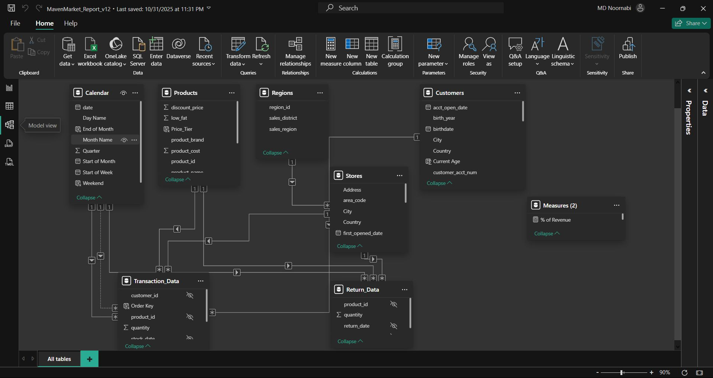

## Retail analytics dashboard (Power BI) with a star schema and DAX KPIs: **Total Revenue**, **Return Rate**, **Active Customers (90d)**.

## Open the Report
- Open **report.pbix** in Power BI Desktop.

## Business Questions
- How are **Revenue** and **Return Rate** trending by month/product/region?
- Which brands/regions drive **profit** and **return rate**?
- How is **Active Customers (last 90 days)** changing over time?
  
## Key Insights 
- Portland hits **1,000+ sales in December** (seasonal peak).
- **Hermanos** delivers the **most profit in 1998**.
- In **1998**, **USA** leads with **93,986 transactions** vs **72,806** in **Mexico** (primary market advantage).

## Screens

## Data & Modeling
- **Measures:** see [`measures.md`](./measures.md)
- **Data notes:** see [`data-notes.md`](./data-notes.md)
- Interactions: **drill-down hierarchies** and edited interactions so slicers filter cleanly.

